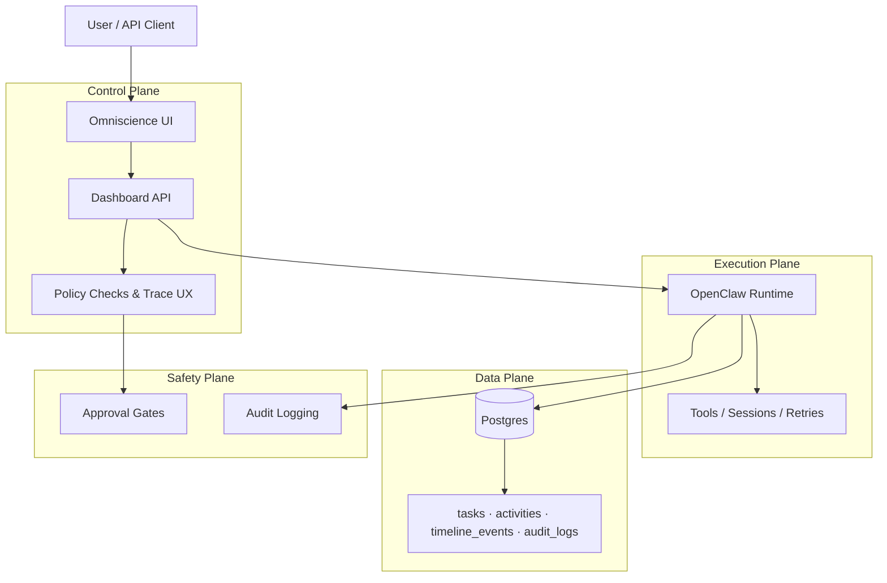

# Omniscience

AI operations control plane for autonomous agent teams.

> **Positioning**: Omniscience = control plane, OpenClaw = execution engine.
> This repo focuses on the open-source core.


---

## Why Omniscience

When agent workflows scale, you need one place to:
- plan and prioritize work (`tasks`)
- observe real execution (`runs`, `activities`, `timeline`)
- audit every meaningful action (`audit_logs`)
- safely operate retries and recovery paths

Omniscience gives that operational layer while OpenClaw executes.

---

## Core Concepts

- **Task**: business intent
- **Run**: one execution attempt (`runId`)
- **Activity**: event stream log for humans and agents
- **Timeline Event**: chronology-facing event for visual tracking
- **Audit Log**: immutable operator change trail

Rule of thumb: **if it isn't linked to `runId/taskId` and written to logs, it didn't happen.**

---

## Architecture



Layers:
1. **Control Plane** (this repo): dashboard, API, policy checks, trace UX
2. **Execution Plane** (OpenClaw): tools, sessions, cron, retries
3. **Data Plane** (Postgres): event/audit persistence
4. **Safety Plane**: approval gates for high-risk actions

---

## Quick Start (10 minutes)

### Prerequisites
- Docker + Docker Compose
- Node.js 22+ (optional for local dev without Docker)

### 1) Clone

```bash
git clone https://github.com/Rainhoole/omniscience-dashboard.git
cd omniscience-dashboard
```

### 2) Configure env

```bash
cp .env.example .env
```

### 3) Start stack

```bash
make up
```

### 4) Initialize schema/data

```bash
make db-push
make db-seed
```

### 5) Verify bootstrap

```bash
make verify
# or (if make is unavailable)
npm run verify
```

### 6) Open app

- http://localhost:3200/login

---

## OpenClaw Integration

### Ingest execution events

`POST /api/openclaw/events`

Writes into:
- `activities`
- `timeline_events`
- optional task status sync

### Ingest operator/ops actions

`POST /api/openclaw/ops`

Writes into:
- `audit_logs`
- `activities`
- `timeline_events`

Auth header for both:

```http
x-openclaw-token: <OPENCLAW_ADAPTER_TOKEN>
```

### Retry lifecycle

`POST /api/openclaw/runs/[runId]/retry`

- triggers a new retry run chain
- links old/new run metadata for traceability
- updates activity/timeline/audit for full visibility

---

## Repository Layout

```text
src/
  app/api/                     # API routes
  components/                  # dashboard UI
  lib/                         # auth, db, ops-log helpers
scripts/
  ops-log.sh                   # simple ops event sender
examples/
  retry-run-chain/             # sample payloads and flow
docs/
  OPERATIONS-HARDENING.md
  ROADMAP-v1.md
  OPEN-SOURCE-PLAN.md
```

---

## Development Commands

| Command | Description |
|---|---|
| `npm run dev` | dev server |
| `npm run build` | production build |
| `npm run verify` | bootstrap reachability check |
| `npm run verify:full` | verify + lint + build |
| `npm run smoke:retry` | retry-chain smoke script |
| `npm run db:push` | sync schema |
| `npm run db:seed` | seed dev data |
| `npm run lint` | lint |

Make shortcuts:

| Command | Description |
|---|---|
| `make up` | start postgres + app |
| `make down` | stop stack |
| `make logs` | stream app logs |
| `make db-push` | push schema inside app container |
| `make db-seed` | seed inside app container |
| `make verify` | run local bootstrap verification |
| `make smoke-retry` | run retry-chain smoke check |

### Optional CI smoke secrets

To enable retry-chain smoke in GitHub Actions, set repo secrets:
- `CI_SMOKE_BASE_URL` (e.g. `https://omniscience.rainhoole.com`)
- `CI_OPENCLAW_ADAPTER_TOKEN`
- `CI_ADMIN_SESSION_COOKIE` (optional; enables full `/retry` endpoint check)
- `CI_SMOKE_TASK_ID` (optional; defaults to all-zero UUID)

---

## Open Source vs Cloud

### Open-source Core (this repo)
- task/run/audit model
- dashboard and APIs
- OpenClaw adapters/events
- self-hosting support

### Planned Cloud / Enterprise (future)
- managed hosting + SLA
- SSO / advanced RBAC
- org-level policy controls
- enterprise support

---

## Contributing

Start here:
- [CONTRIBUTING.md](CONTRIBUTING.md)
- [Code of Conduct](CODE_OF_CONDUCT.md)
- [Open Source Plan](docs/OPEN-SOURCE-PLAN.md)
- [Release Checklist](docs/RELEASE-CHECKLIST.md)

---

## License

Apache-2.0. See [LICENSE](LICENSE).
